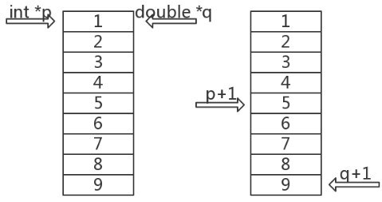

# C/C++中的void*

### 0x00 引言

:::warning
现代C++并不推荐这样做
:::

```cpp
void* say_hello(void* args){
    std::cout << "Hello" << std::endl;
    return 0;
}
```

### 0x01 void* 是啥

C/C++中，\*类型就是指针类型，如`int* p` ,`double* q`，这两虽然是不同的指针但是`sizeof(p) == sizeof(q)`，因为它们是同一种类型，\*类型。C/cpp是强类型语言，严格区分类型。至于不同，p++，q++就可看出。



对于这两个指针而言，++操作对应的跳转大小不同，int\*跳4字节，double\*跳8字节；即 void\*是一种跳跃长度未定的指针（无类型指针）。

### 0x02 void* 用法

* void\*可以指向任意类型的地址，但是有类型指针无法指向void\*的地址

```cpp
int x = 1;
int* x_ptr = &x;
void* ptr = x_ptr;
int* p_ptr = ptr;// 错误
```

* void*类型强转后才可取值

```cpp
int x = 1;
int* x_ptr = &x;
void* ptr = x_ptr;
cout << *(int*)ptr << endl;
```

* 可以通过0或者NULL来初始化，表示空指针

```cpp
void* ptr1 = 0;
void* ptr2 = NULL;
cout << ptr1 << " " << ptr2 << endl;
// 0x0 0x0
```

* void*可以作为函数的输入与输出（接受任意类型的指针）

```cpp
void* test(void* x) { return x; }

int main() {
 static int x = 5;
 int* ptr = &x;
 cout << ptr << endl;               // 0x5593a4b6c010
 cout << test(ptr) << endl;         // 0x5593a4b6c010
 cout << test((void*)ptr) << endl;  // 0x5593a4b6c010
 return 0;
}
```

* void*与void差别

```cpp
void* say_hello(void* args){
   std::cout << "Hello" << std::endl;
   return 0;
}// 有返回值
void say_hello(void* args){
   std::cout << "Hello" << std::endl;
   return;
}// 无返回值
```

* 函数传参不确定时

```cpp
void test(int data_type, void* data) {
switch (data_type) {
  case 0:
    int* x = (int*)data;
    break;
  default:
    float* x = (float*)data;
    break;
}
}
```

* 返回值不开率类型只关心大小时

```cpp
void* memcpy(void* dest, const void* src, size_t len);
void* memset(void* buffer, int c, size_t num);

int *arr = (int*)malloc(sizeof(int));
```

* 函数指针

```cpp
void* (*)(void*); // // 无名的函数指针类型，参数void*，返回值void*
```

   